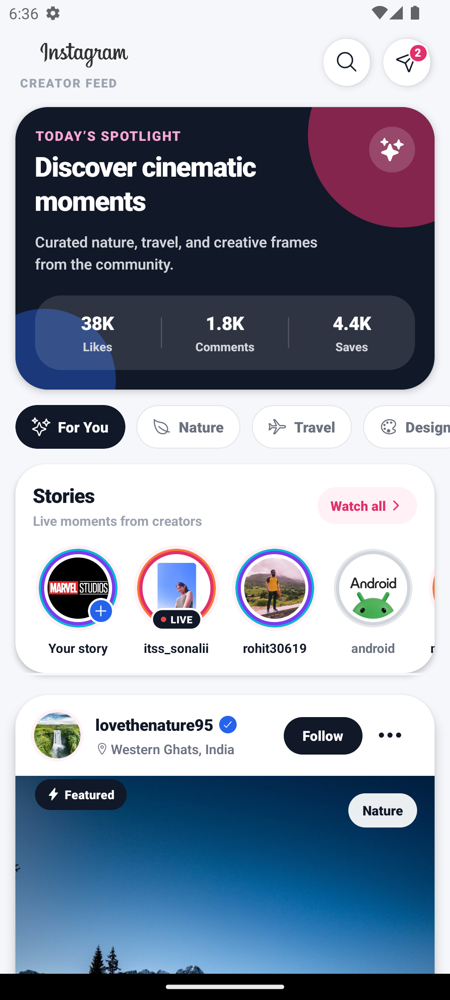
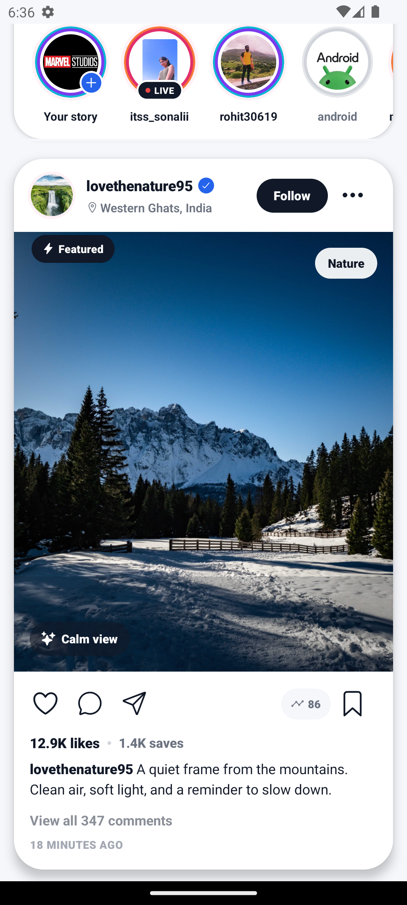

<div align="center">

# ✨ Instagram Clone — Premium Material React Native Feed UI

A modern, polished, and production-style **Instagram-inspired creator feed UI** built with **React Native**.  
Designed with a premium material aesthetic, cinematic post cards, story rings, creator filters, interactive actions, safe-area support, and performance-focused feed rendering.

<br />

<p align="center">
  <table>
    <tr>
      <td align="center">
        
      </td>
      <td align="center">
        
      </td>
    </tr>
   
  </table>
</p>

<br />
<br />


</div>

---

## 📌 Overview

**Instagram Clone — Premium Material Feed UI** is a beautifully redesigned React Native social feed interface.  
It upgrades a basic Instagram-style clone into a more professional, app-store-ready mobile UI with a unique creator-feed concept.

The project focuses on:

- Premium material-style layout
- Clean component architecture
- Smooth feed performance
- Interactive post actions
- Modern safe-area handling
- Beautiful creator discovery experience
- Scalable data-driven UI structure

> This project uses `react-native-safe-area-context` instead of the deprecated React Native core `SafeAreaView`.

---

## 🖼️ Preview

<p align="center">
  <table>
    <tr>
      <td align="center">
        
      </td>
      <td align="center">
        
      </td>
    </tr>
   
  </table>
</p>

---

## ✨ Key Features

### 🎨 Premium Material UI Concept

The UI is designed with a clean, premium, and modern creator-feed experience:

- Soft app background
- Floating white surface cards
- Large cinematic post previews
- Rounded material-style containers
- Deep but subtle card shadows
- Premium typography hierarchy
- Polished icon buttons
- Creator-focused visual layout
- Beautiful dark spotlight section

---

### 🌟 Spotlight Hero Panel

A unique top hero section is added to make the feed feel more professional and engaging.

It includes:

- Today’s spotlight section
- Dark premium gradient-style card
- Creator discovery copy
- Floating decorative orbs
- Feed engagement stats
- Sparkle icon bubble

---

### 🧭 Category Filter Rail

The feed now includes material filter chips for content discovery.

| Filter | Purpose |
|---|---|
| For You | Shows all posts |
| Nature | Shows nature content |
| Travel | Shows travel content |
| Design | Shows creative/design content |

Each filter chip includes an Ionicon, active state, and clean material styling.

---

### 🟣 Advanced Story Section

The story row now feels more like a premium creator app.

| Feature | Description |
|---|---|
| Add Story | Adds a plus badge for the current user |
| Live Story | Shows a live badge with live dot |
| Seen Story | Uses muted calm styling |
| Story Ring Moods | Supports hot, fresh, and calm ring states |
| Watch All Button | Adds a polished story action button |
| Optimized List | Uses horizontal `FlatList` with `getItemLayout` |

---

### 🖼️ Cinematic Post Cards

Each post card has been upgraded with a premium presentation.

Includes:

- Creator avatar frame
- Username and verified badge
- Location row with icon
- Follow / Following state
- Featured ribbon
- Large responsive image
- Image mood badge
- Category badge
- Image shade overlay
- Like, comment, share, save actions
- Shares and saves metrics
- Expandable caption
- Timestamp and comments preview

---

### ❤️ Real Interactive Actions

The UI includes local state-based interactivity.

| Action | Behavior |
|---|---|
| Like | Toggles heart icon and updates like count |
| Double Tap | Triggers heart burst animation |
| Save | Toggles bookmark state |
| Follow | Switches between Follow and Following |
| Read More | Expands long captions |
| Filter | Filters feed by post category |
| Menu | Ready for post action sheet integration |
| Comment | Ready for comments screen integration |
| Share | Ready for share sheet integration |

---

### 💥 Double-Tap Like Animation

Posts support a premium double-tap interaction:

- Double-tap image to like
- Heart burst animation appears over the image
- Like state updates automatically
- Smooth `Animated.spring` and fade-out animation

---

### 🛡️ Modern Safe Area Handling

The app avoids deprecated core `SafeAreaView` and uses the recommended safe-area package.

```tsx
import {SafeAreaProvider, SafeAreaView} from 'react-native-safe-area-context';
```

The root layout is wrapped with:

```tsx
<SafeAreaProvider>
  <SafeAreaView edges={['top']} style={styles.safeArea}>
    {/* App Content */}
  </SafeAreaView>
</SafeAreaProvider>
```

---

### ⚡ Performance Optimized

The feed is optimized for smooth rendering:

- `FlatList` instead of nested `ScrollView`
- Stable item IDs
- `React.memo` for reusable components
- `useCallback` for render functions
- `useMemo` for filtered posts and like count
- `initialNumToRender` configured
- `maxToRenderPerBatch` configured
- `windowSize` configured
- `removeClippedSubviews` enabled
- Horizontal story list uses `getItemLayout`

---

## 🛠️ Tech Stack

| Technology | Usage |
|---|---|
| React Native | Mobile app framework |
| TypeScript | Type-safe app structure |
| JavaScript | Component logic and styling |
| Ionicons | Professional vector icons |
| React Native Safe Area Context | Modern safe-area handling |
| React Native Animated | Double-tap heart animation |
| FlatList | Optimized feed and story rendering |
| StyleSheet | Native styling system |

---

## 📦 Dependencies

Install the required packages:

```bash
npm install @react-native-vector-icons/ionicons
npm install react-native-safe-area-context
```

For iOS, run:

```bash
cd ios
pod install
cd ..
```

---

## 📂 Project Structure

```text
instagramclone/
│
├── App.tsx
│
├── resource/
│   └── styles.js
│
├── instagramclone/
│   ├── CircleImageList.js
│   └── PostView.js
│
├── assets/
│   ├── icons/
│   │   └── instagram_logo_text.png
│   │
│   ├── images/
│   │   ├── image5.jpg
│   │   ├── image6.jpg
│   │   ├── image7.jpg
│   │   ├── image8.jpg
│   │   ├── image9.jpg
│   │   ├── image10.jpg
│   │   ├── lovethenature95.jpg
│   │   └── nature_beauty511.jpg
│   │
│   └── post/
│       ├── post01.jpg
│       └── post02.jpg
│
└── screenshots/
    └── home-feed-preview.png
```

---

## 🚀 Getting Started

### 1. Clone the repository

```bash
git clone https://github.com/your-username/instagramclone.git
cd instagramclone
```

---

### 2. Install dependencies

```bash
npm install
```

---

### 3. Install required UI packages

```bash
npm install @react-native-vector-icons/ionicons
npm install react-native-safe-area-context
```

---

### 4. Start Metro

```bash
npx react-native start --reset-cache
```

---

### 5. Run on Android

Open another terminal and run:

```bash
npx react-native run-android
```

---

## ✅ Important Icon Setup

This project uses the modern package-per-icon-set Ionicons setup:

```js
import {Ionicons} from '@react-native-vector-icons/ionicons/static';
```

Do **not** add this old Gradle line:

```gradle
apply from: "../../node_modules/react-native-vector-icons/fonts.gradle"
```

The modern Ionicons package does not need that old `fonts.gradle` script.

---

## 🧩 Main Components

### `App.tsx`

Responsible for:

- App root layout
- Modern safe-area provider
- Feed data
- Story data
- Filter data
- Category-based post filtering
- Main `FlatList`
- Toolbar
- Spotlight hero panel
- Filter rail
- Feed header composition

---

### `CircleImageList.js`

Responsible for the premium story section.

Supports:

- Add story badge
- Live story badge with dot
- Seen story styling
- Hot, fresh, and calm story ring moods
- Watch all action
- Horizontal optimized story list
- Accessible story buttons

---

### `PostView.js`

Responsible for each premium post card.

Supports:

- Like state
- Save state
- Follow state
- Read-more caption state
- Double-tap-to-like animation
- Verified badge
- Featured ribbon
- Mood badge
- Category badge
- Engagement metrics
- Count formatting
- Responsive image height
- Material card styling

---

### `styles.js`

Responsible for shared app styling.

Includes:

- App background
- Toolbar styling
- Hero panel styling
- Filter chip styling
- Badge styling
- Shared shadows
- Safe-area container
- Feed spacing
- Shared hit slop

---

## 🧠 Data Models

### Story Item

```ts
type StoryItem = {
  id: string;
  image: ImageSourcePropType;
  text: string;
  seen?: boolean;
  isLive?: boolean;
  isAdd?: boolean;
  ring?: 'hot' | 'fresh' | 'calm';
};
```

---

### Feed Post

```ts
type FeedPost = {
  id: string;
  username: string;
  fullName?: string;
  location?: string;
  verified?: boolean;
  following?: boolean;
  userAvatar: ImageSourcePropType;
  userPostImage: ImageSourcePropType;
  likes: number;
  comments: number;
  shares?: number;
  saves?: number;
  caption: string;
  timeAgo: string;
  category: 'Nature' | 'Travel' | 'Design';
  mood: string;
  featured?: boolean;
};
```

---

### Filter Item

```ts
type FilterItem = {
  id: 'All' | 'Nature' | 'Travel' | 'Design';
  label: string;
  icon: keyof typeof Ionicons.glyphMap;
};
```

---

## 🎯 Customization Guide

### Change brand colors

In `styles.js`:

```js
brand: '#E1306C',
accent: '#F77737',
violet: '#7C3AED',
blue: '#2563EB',
```

In `PostView.js`:

```js
instagram: '#E1306C',
blue: '#2563EB',
orange: '#F77737',
green: '#10B981',
```

---

### Add a new story

In `App.tsx`:

```ts
{
  id: 'new-story',
  image: require('./assets/images/image5.jpg'),
  text: 'new_user',
  isLive: true,
  ring: 'fresh',
}
```

---

### Add a new post

In `App.tsx`:

```ts
{
  id: 'post-new-01',
  username: 'travel.frames',
  fullName: 'Travel Frames',
  location: 'Himalayas, India',
  verified: true,
  featured: true,
  category: 'Travel',
  mood: 'Golden hour',
  userAvatar: require('./assets/images/lovethenature95.jpg'),
  userPostImage: require('./assets/post/post01.jpg'),
  likes: 23000,
  comments: 420,
  shares: 98,
  saves: 1800,
  caption: 'A peaceful frame from the mountains.',
  timeAgo: '10 minutes ago',
}
```

---

### Add a new filter

Update the `FilterItem` type and `filters` array in `App.tsx`.

```ts
{id: 'Design', label: 'Design', icon: 'color-palette-outline'}
```

Then assign the same category to posts:

```ts
category: 'Design'
```

---

## 🐞 Troubleshooting

### Icons showing as square boxes

Install the modern Ionicons package:

```bash
npm install @react-native-vector-icons/ionicons
```

Use this import:

```js
import {Ionicons} from '@react-native-vector-icons/ionicons/static';
```

Remove this old Gradle line if it exists:

```gradle
apply from: "../../node_modules/react-native-vector-icons/fonts.gradle"
```

Clean and rebuild:

```bash
cd android
.\gradlew clean
cd ..
npx react-native start --reset-cache
npx react-native run-android
```

---

### SafeAreaView deprecated warning

Use:

```bash
npm install react-native-safe-area-context
```

Then import:

```tsx
import {SafeAreaProvider, SafeAreaView} from 'react-native-safe-area-context';
```

Do not import `SafeAreaView` from `react-native`.

---

### Metro cache issue

```bash
npx react-native start --reset-cache
```

---

### Android build issue

```bash
cd android
.\gradlew clean
cd ..
npx react-native run-android
```

---

## 🏆 Why This Project Looks Professional

This project avoids a basic clone-style UI and follows a more polished mobile product approach.

It includes:

- Premium material design language
- Strong visual hierarchy
- Scalable component structure
- Data-driven rendering
- Optimized list performance
- Modern safe-area handling
- Proper vector icons
- Local UI interaction states
- Double-tap like animation
- Creator-focused hero section
- Discoverable category filters
- Clean readable documentation

---

## 🔮 Future Improvements

- Add dark mode
- Add bottom navigation
- Add comments screen
- Add user profile screen
- Add post upload screen
- Add image carousel posts
- Add reels screen
- Add search screen
- Add pull-to-refresh
- Add skeleton loading states
- Add Firebase authentication
- Add Firebase backend feed
- Add persistent like/save state
- Add real share sheet integration

---

## 🤝 Contributing

Contributions are welcome.

You can contribute by:

- Improving UI animations
- Adding new screens
- Optimizing performance
- Fixing bugs
- Improving documentation
- Adding backend integration

---

## 📄 License

This project is open-source and available under the **MIT License**.

---

<div align="center">

### ⭐ Support

If this project helped you, consider giving it a star on GitHub.

**Built with ❤️ using React Native**

</div>
