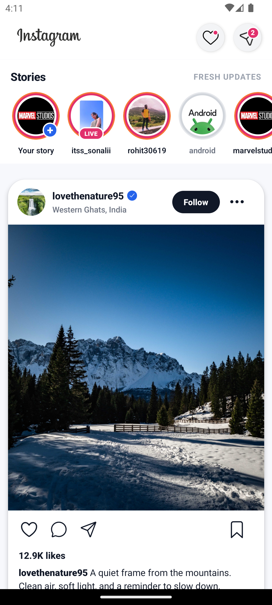

<div align="center">

# ✨ Instagram Clone — Premium React Native Feed UI

A polished, modern, and production-style **Instagram-inspired social feed UI** built with **React Native**.
Designed with clean components, beautiful cards, story rings, interactive post actions, verified badges, and professional mobile-first spacing.

<br />



<br />
<br />


</div>

---

## 📌 Overview

This project is a professionally upgraded **Instagram-style mobile feed interface** created using **React Native**.
It focuses on a clean UI, reusable components, smooth mobile layout, optimized feed rendering, and production-ready code structure.

The UI includes:

* Beautiful top toolbar with notification and message badges
* Horizontal story section with live, seen, and add-story states
* Premium card-style post layout
* Like, comment, share, save, follow, and menu actions
* Verified user badge
* Location, caption, likes, comments, and timestamp support
* Vector icons using Ionicons
* Optimized rendering using `FlatList`, `memo`, `useCallback`, and `useMemo`

---

## ✨ Features

### 🎨 Premium UI Design

The layout is designed to feel modern and app-store ready:

* Soft background surface
* Rounded post cards
* Clean shadows and elevation
* Professional spacing
* Balanced typography
* Instagram-inspired accent colors
* Mobile-first visual hierarchy

---

### 🟣 Story Section

The story row supports multiple story states:

| Feature           | Description                             |
| ----------------- | --------------------------------------- |
| Add Story         | Shows a plus badge for the current user |
| Live Story        | Shows a live badge                      |
| Seen Story        | Uses muted ring styling                 |
| Horizontal Scroll | Smooth story browsing                   |
| Optimized List    | Uses `FlatList` with `getItemLayout`    |

---

### 🖼️ Feed Post Card

Each post card includes:

* User avatar
* Username
* Verified badge
* Location text
* Follow / Following state
* More menu icon
* Large responsive post image
* Like, comment, share, and save actions
* Likes count formatting
* Caption
* Comments preview
* Time label

---

### ❤️ Interactive Actions

The post UI is not only static. It includes real local UI state:

| Action  | Behavior                                  |
| ------- | ----------------------------------------- |
| Like    | Toggles heart icon and updates like count |
| Save    | Toggles bookmark icon                     |
| Follow  | Switches between Follow and Following     |
| Menu    | Ready for post options                    |
| Comment | Ready for comment screen integration      |
| Share   | Ready for share sheet integration         |

---

### ⚡ Performance Optimized

The feed is built with performance in mind:

* `FlatList` instead of nested `ScrollView`
* Stable keys using post IDs
* Memoized components
* `useCallback` for render functions
* `useMemo` for like-count calculation
* `initialNumToRender`, `maxToRenderPerBatch`, and `windowSize` configured
* `removeClippedSubviews` enabled for better list performance

---

## 🛠️ Tech Stack

| Technology              | Usage                       |
| ----------------------- | --------------------------- |
| React Native            | Mobile app framework        |
| TypeScript              | Type-safe app structure     |
| JavaScript              | Component logic and styling |
| Ionicons                | Professional vector icons   |
| React Native StyleSheet | Native styling              |
| FlatList                | Optimized list rendering    |

---

## 📂 Project Structure

```text
instagramclone/
│
├── App.tsx
│
├── resource/
│   └── styles.js
│
├── instagramclone/
│   ├── CircleImageList.js
│   └── PostView.js
│
├── assets/
│   ├── icons/
│   │   ├── instagram_logo_text.png
│   │   ├── ic_activity_button.png
│   │   └── ic_messaging_button.png
│   │
│   ├── images/
│   │   ├── image5.jpg
│   │   ├── image6.jpg
│   │   ├── image7.jpg
│   │   ├── image8.jpg
│   │   ├── image9.jpg
│   │   ├── image10.jpg
│   │   ├── lovethenature95.jpg
│   │   └── nature_beauty511.jpg
│   │
│   └── post/
│       ├── post01.jpg
│       └── post02.jpg
│
└── screenshots/
    └── home-feed-preview.png
```

---

## 🚀 Getting Started

### 1. Clone the repository

```bash
git clone https://github.com/your-username/instagramclone.git
cd instagramclone
```

---

### 2. Install dependencies

```bash
npm install
```

---

### 3. Install Ionicons

This project uses Ionicons for clean professional icons.

```bash
npm install @react-native-vector-icons/ionicons
```

---

### 4. Run Metro

```bash
npx react-native start --reset-cache
```

---

### 5. Run on Android

Open another terminal and run:

```bash
npx react-native run-android
```

---

## ✅ Important Icon Setup

This project uses the modern package-per-icon-set setup:

```js
import {Ionicons} from '@react-native-vector-icons/ionicons/static';
```

Do **not** add this old Gradle line:

```gradle
apply from: "../../node_modules/react-native-vector-icons/fonts.gradle"
```

The modern Ionicons package does not need that old `fonts.gradle` script.

---

## 🧩 Main Components

### `App.tsx`

The root screen manages:

* Stories data
* Feed posts data
* Main `FlatList`
* Header composition
* Toolbar
* Feed rendering

---

### `CircleImageList.js`

Responsible for the story section.

It supports:

* Live badge
* Add story badge
* Seen story styling
* Horizontal optimized list
* Accessible story buttons

---

### `PostView.js`

Responsible for each post card.

It supports:

* Like state
* Save state
* Follow state
* Verified badge
* Count formatting
* Ionicons actions
* Responsive image height
* Premium post-card styling

---

### `styles.js`

Responsible for shared app-level styling:

* App background
* Toolbar
* Notification badge
* Message badge
* Feed spacing
* Shared hit slop

---

## 🧠 Data Model

### Story Item

```ts
type StoryItem = {
  id: string;
  image: ImageSourcePropType;
  text: string;
  seen?: boolean;
  isLive?: boolean;
  isAdd?: boolean;
};
```

---

### Feed Post

```ts
type FeedPost = {
  id: string;
  username: string;
  fullName?: string;
  location?: string;
  verified?: boolean;
  following?: boolean;
  userAvatar: ImageSourcePropType;
  userPostImage: ImageSourcePropType;
  likes: number;
  comments: number;
  caption: string;
  timeAgo: string;
};
```

---

## 🎯 Customization Guide

### Change brand color

In `PostView.js`:

```js
instagram: '#E1306C',
```

In `styles.js`:

```js
brand: '#E1306C',
accent: '#F77737',
```

---

### Add a new story

In `App.tsx`:

```ts
{
  id: 'new-story',
  image: require('./assets/images/image5.jpg'),
  text: 'new_user',
  isLive: true,
}
```

---

### Add a new post

In `App.tsx`:

```ts
{
  id: 'post-new-01',
  username: 'travel.frames',
  fullName: 'Travel Frames',
  location: 'Himalayas, India',
  verified: true,
  userAvatar: require('./assets/images/lovethenature95.jpg'),
  userPostImage: require('./assets/post/post01.jpg'),
  likes: 23000,
  comments: 420,
  caption: 'A peaceful frame from the mountains.',
  timeAgo: '10 minutes ago',
}
```

---

## 🐞 Troubleshooting

### Icons showing as square boxes

Use the modern Ionicons package:

```bash
npm install @react-native-vector-icons/ionicons
```

Use this import:

```js
import {Ionicons} from '@react-native-vector-icons/ionicons/static';
```

Remove this old Gradle line if you added it:

```gradle
apply from: "../../node_modules/react-native-vector-icons/fonts.gradle"
```

Then clean and rebuild:

```bash
cd android
.\gradlew clean
cd ..
npx react-native start --reset-cache
npx react-native run-android
```

---

### Metro cache issue

```bash
npx react-native start --reset-cache
```

---

### Android build issue

```bash
cd android
.\gradlew clean
cd ..
npx react-native run-android
```

---

## 🏆 Why This Project Looks Professional

This UI avoids a basic clone-style structure and follows better frontend practices:

* Data-driven rendering
* Component-based architecture
* Reusable UI states
* Clean visual spacing
* Production-style card layout
* Optimized list performance
* Accessible buttons
* Proper vector icons
* Scalable data models
* Easy customization

---

## 📸 Screenshot

<div align="center">


</div>

---

## 🔮 Future Improvements

* Add dark mode
* Add comments screen
* Add profile screen
* Add double-tap-to-like animation
* Add image carousel posts
* Add reels tab
* Add bottom navigation
* Add Firebase backend
* Add authentication
* Add upload post feature

---

## 🤝 Contributing

Contributions are welcome.

You can contribute by:

* Improving UI animations
* Adding new screens
* Optimizing performance
* Fixing bugs
* Improving documentation
* Adding backend integration

---

## 📄 License

This project is open-source and available under the **MIT License**.

---

<div align="center">

### ⭐ Support

If this project helped you, consider giving it a star on GitHub.

**Built with ❤️ using React Native**

</div>
